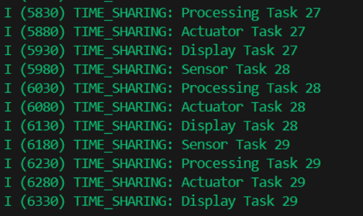

lab-00-multitasking-evolution
    lab1-single-vs-multiple 
    1. 
    2. 

    lab2-time-sharing impletion
    1.
    SD
    2.--- 0x40080638: call_start_cpu0 at C:/Users/HP/esp/v5.5.1/esp-idf/components/bootloader/subproject/main/bootloader_start.c:25
    I (29) boot: ESP-IDF v5.5.1 2nd stage bootloader
    I (29) boot: compile time Oct  8 2025 10:48:47
    I (29) boot: Multicore bootloader
    I (31) boot: chip revision: v3.1
    I (33) boot.esp32: SPI Speed      : 40MHz
    I (37) boot.esp32: SPI Mode       : DIO
    I (41) boot.esp32: SPI Flash Size : 2MB
    I (44) boot: Enabling RNG early entropy source...
    I (49) boot: Partition Table:
    I (51) boot: ## Label            Usage          Type ST Offset   Length
    I (58) boot:  0 nvs              WiFi data        01 02 00009000 00006000
    I (64) boot:  1 phy_init         RF data          01 01 0000f000 00001000
    I (71) boot:  2 factory          factory app      00 00 00010000 00100000
    I (77) boot: End of partition table
    I (81) esp_image: segment 0: paddr=00010020 vaddr=3f400020 size=0a4b0h ( 42160) map
    I (102) esp_image: segment 1: paddr=0001a4d8 vaddr=3ffb0000 size=023f8h (  9208) load
    I (106) esp_image: segment 2: paddr=0001c8d8 vaddr=40080000 size=03740h ( 14144) load
    I (112) esp_image: segment 3: paddr=00020020 vaddr=400d0020 size=14974h ( 84340) map
    I (143) esp_image: segment 4: paddr=0003499c vaddr=40083740 size=09870h ( 39024) load
    I (158) esp_image: segment 5: paddr=0003e214 vaddr=50000000 size=00020h (    32) load
    I (165) boot: Loaded app from partition at offset 0x10000
    I (165) boot: Disabling RNG early entropy source...
    I (176) cpu_start: Multicore app
    I (185) cpu_start: Pro cpu start user code
    I (185) cpu_start: cpu freq: 160000000 Hz
    I (185) app_init: Application information:
    I (185) app_init: Project name:     lab2-2-Time-Sharing
    I (190) app_init: App version:      813e069
    I (194) app_init: Compile time:     Oct  8 2025 10:48:10
    I (199) app_init: ELF file SHA256:  f07551d81...
    I (203) app_init: ESP-IDF:          v5.5.1
    I (207) efuse_init: Min chip rev:     v0.0
    I (211) efuse_init: Max chip rev:     v3.99 
    I (215) efuse_init: Chip rev:         v3.1
    I (219) heap_init: Initializing. RAM available for dynamic allocation:
    I (225) heap_init: At 3FFAE6E0 len 00001920 (6 KiB): DRAM
    I (230) heap_init: At 3FFB2CE0 len 0002D320 (180 KiB): DRAM
    I (235) heap_init: At 3FFE0440 len 00003AE0 (14 KiB): D/IRAM
    I (240) heap_init: At 3FFE4350 len 0001BCB0 (111 KiB): D/IRAM
    I (246) heap_init: At 4008CFB0 len 00013050 (76 KiB): IRAM
    I (253) spi_flash: detected chip: generic
    I (255) spi_flash: flash io: dio
    W (258) spi_flash: Detected size(4096k) larger than the size in the binary image header(2048k). Using the size in the binary image header.  
    I (271) main_task: Started on CPU0
    I (281) main_task: Calling app_main()
    I (281) TIME_SHARING: Time-Sharing System Started
    I (281) TIME_SHARING: Time slice: 50 ms
    I (281) TIME_SHARING: Sensor Task 0
    I (331) TIME_SHARING: Processing Task 0
    I (381) TIME_SHARING: Actuator Task 0
    I (431) TIME_SHARING: Display Task 0
    I (481) TIME_SHARING: Sensor Task 1
    I (531) TIME_SHARING: Processing Task 1
    I (581) TIME_SHARING: Actuator Task 1
    I (631) TIME_SHARING: Display Task 1
    I (681) TIME_SHARING: Sensor Task 2
    I (731) TIME_SHARING: Processing Task 2
    I (781) TIME_SHARING: Actuator Task 2
    I (831) TIME_SHARING: Display Task 2
    I (881) TIME_SHARING: Sensor Task 3
    I (931) TIME_SHARING: Processing Task 3
    I (981) TIME_SHARING: Actuator Task 3
    I (1031) TIME_SHARING: Display Task 3
    I (1081) TIME_SHARING: Sensor Task 4
    I (1131) TIME_SHARING: Processing Task 4
    I (1181) TIME_SHARING: Actuator Task 4
    I (1231) TIME_SHARING: Display Task 4
    I (1281) TIME_SHARING: === Round 1 Statistics ===
    I (1281) TIME_SHARING: Context switches: 20
    I (1281) TIME_SHARING: Total time: 996181 us
    I (1281) TIME_SHARING: Task execution time: 75622 us
    I (1281) TIME_SHARING: CPU utilization: 7.6%
    I (1291) TIME_SHARING: Overhead: 92.4%
    I (1291) TIME_SHARING: Avg time per task: 3781 us
    I (1291) TIME_SHARING: Sensor Task 5
    I (1351) TIME_SHARING: Processing Task 5
    I (1401) TIME_SHARING: Actuator Task 5
    I (1451) TIME_SHARING: Display Task 5
    I (1501) TIME_SHARING: Sensor Task 6
    I (1551) TIME_SHARING: Processing Task 6
    I (1601) TIME_SHARING: Actuator Task 6
    I (1651) TIME_SHARING: Display Task 6
    I (1701) TIME_SHARING: Sensor Task 7
    I (1751) TIME_SHARING: Processing Task 7
    I (1801) TIME_SHARING: Actuator Task 7
    I (1851) TIME_SHARING: Display Task 7
    I (1901) TIME_SHARING: Sensor Task 8
    I (1951) TIME_SHARING: Processing Task 8
    I (2001) TIME_SHARING: Actuator Task 8
    I (2051) TIME_SHARING: Display Task 8
    I (2101) TIME_SHARING: Sensor Task 9
    I (2151) TIME_SHARING: Processing Task 9
    I (2201) TIME_SHARING: Actuator Task 9
    I (2251) TIME_SHARING: Display Task 9

    3.
    I (35961) TIME_SHARING: === Round 35 Statistics ===
    I (35961) TIME_SHARING: Context switches: 700
    I (35961) TIME_SHARING: Total time: 35676181 us
    I (35961) TIME_SHARING: Task execution time: 2658727 us
    I (35961) TIME_SHARING: CPU utilization: 7.5%
    I (35971) TIME_SHARING: Overhead: 92.5%
    I (35971) TIME_SHARING: Avg time per task: 3798 us
    I (35971) TIME_SHARING: Sensor Task 175
    I (36031) TIME_SHARING: Processing Task 175
    I (36081) TIME_SHARING: Actuator Task 175
    I (36131) TIME_SHARING: Display Task 175
    I (36181) TIME_SHARING: Sensor Task 176
    I (36231) TIME_SHARING: Processing Task 176
    I (36281) TIME_SHARING: Actuator Task 176
    I (36331) TIME_SHARING: Display Task 176
    I (36381) TIME_SHARING: Sensor Task 177
    I (36431) TIME_SHARING: Processing Task 177
    I (36481) TIME_SHARING: Actuator Task 177
    I (36531) TIME_SHARING: Display Task 177
    I (36581) TIME_SHARING: Sensor Task 178
    I (36631) TIME_SHARING: Processing Task 178
    I (36681) TIME_SHARING: Actuator Task 178
    I (36731) TIME_SHARING: Display Task 178
    I (36781) TIME_SHARING: Sensor Task 179
    I (36831) TIME_SHARING: Processing Task 179
    I (36881) TIME_SHARING: Actuator Task 179
    I (36931) TIME_SHARING: Display Task 179

    lab3
    1.
    I (27891) COOPERATIVE: Coop Task1 running: 188
    W (27891) COOPERATIVE: Task1 yielding for emergency
    I (27901) COOPERATIVE: Coop Task2 running: 188
    W (27901) COOPERATIVE: Task2 yielding for emergency
    W (27911) COOPERATIVE: 🚨 EMERGENCY RESPONSE! Response time: 20 ms (Max: 20 ms)
    W (28221) COOPERATIVE: Emergency button pressed!
    I (28221) COOPERATIVE: Coop Task1 running: 189
    W (28221) COOPERATIVE: Task1 yielding for emergency
    I (28231) COOPERATIVE: Coop Task2 running: 189
    W (28231) COOPERATIVE: Task2 yielding for emergency
    W (28241) COOPERATIVE: 🚨 EMERGENCY RESPONSE! Response time: 20 ms (Max: 20 ms)
    W (28551) COOPERATIVE: Emergency button pressed!
    I (28551) COOPERATIVE: Coop Task1 running: 190
    W (28551) COOPERATIVE: Task1 yielding for emergency
    I (28561) COOPERATIVE: Coop Task2 running: 190
    W (28561) COOPERATIVE: Task2 yielding for emergency
    W (28571) COOPERATIVE: 🚨 EMERGENCY RESPONSE! Response time: 20 ms (Max: 20 ms)
    W (28881) COOPERATIVE: Emergency button pressed!
    I (28881) COOPERATIVE: Coop Task1 running: 191

    2.
    I (278) main_task: Started on CPU0
    I (288) main_task: Calling app_main()
    I (288) ADC_ENHANCED: eFuse Two Point: ไม่รองรับ
    I (288) ADC_ENHANCED: eFuse Vref: รองรับ
    I (288) ADC_ENHANCED: ใช้การปรับเทียบแบบ eFuse Vref
    I (298) ADC_ENHANCED: ทดสอบการปรับปรุงความแม่นยำ ADC
    I (308) ADC_ENHANCED: เทคนิค: Oversampling + Moving Average Filter
    I (318) ADC_ENHANCED: Pin: GPIO34 (ADC1_CH6)
    I (318) ADC_ENHANCED: Oversamples: 100, Filter Size: 10
    I (318) ADC_ENHANCED: ----------------------------------------
    I (338) ADC_ENHANCED: === การเปรียบเทียบ ===
    I (338) ADC_ENHANCED: Raw ADC: 0 (0.142V)
    I (338) ADC_ENHANCED: Oversampled: 0.0 (0.142V)
    I (338) ADC_ENHANCED: Filtered: 0.0 (0.142V)
    I (348) ADC_ENHANCED:

    3.

lab-01-freertos-overview

lab-02-task-and-scheduling
    lab-1
        step 1 :
        I (2400) PRIORITY_DEMO: Low priority running (1)
        I (2490) PRIORITY_DEMO: HIGH PRIORITY RUNNING (1)
        I (2490) PRIORITY_DEMO: Medium priority running (1)
        I (2690) PRIORITY_DEMO: HIGH PRIORITY RUNNING (2)
        I (2800) PRIORITY_DEMO: Medium priority running (2)
        I (2890) PRIORITY_DEMO: HIGH PRIORITY RUNNING (3)
        I (3010) PRIORITY_DEMO: Low priority running (2)
        I (3090) PRIORITY_DEMO: HIGH PRIORITY RUNNING (4)
        I (3110) PRIORITY_DEMO: Medium priority running (3)
        I (3290) PRIORITY_DEMO: HIGH PRIORITY RUNNING (5)
        I (3420) PRIORITY_DEMO: Medium priority running (4)
        I (3490) PRIORITY_DEMO: HIGH PRIORITY RUNNING (6)
        I (3630) PRIORITY_DEMO: Low priority running (3)
        
        step 2 :
        I (3000) PRIORITY_DEMO: Equal Priority Task 1 running
        I (3000) PRIORITY_DEMO: Equal Priority Task 2 running
        I (3010) PRIORITY_DEMO: Equal Priority Task 3 running
        I (3030) PRIORITY_DEMO: Low priority running (1)
        I (3080) PRIORITY_DEMO: Equal Priority Task 1 running
        I (3080) PRIORITY_DEMO: Equal Priority Task 3 running
        I (3090) PRIORITY_DEMO: HIGH PRIORITY RUNNING (1)
        I (3090) PRIORITY_DEMO: Medium priority running (1)
        
        step 3 :
        I (271) main_task: Started on CPU0
        I (281) main_task: Calling app_main()
        I (281) PRIORITY_DEMO: === FreeRTOS Priority Scheduling Demo ===
        I (281) PRIORITY_DEMO: Creating tasks with different priorities...
        I (281) PRIORITY_DEMO: High Priority Task started (Priority 5)
        I (291) PRIORITY_DEMO: Medium Priority Task started (Priority 3)
        I (291) PRIORITY_DEMO: Control Task started
        I (301) PRIORITY_DEMO: Low Priority Task started (Priority 1)
        I (301) PRIORITY_DEMO: Priority Inversion HIGH started (Priority 5)
        I (301) PRIORITY_DEMO: Press button to start priority test
        I (301) PRIORITY_DEMO: Priority Inversion LOW started (Priority 1)
        I (311) PRIORITY_DEMO: Watch LEDs: GPIO2=High, GPIO4=Med, GPIO5=Low priority
        I (331) main_task: Returned from app_main()
        W (16601) PRIORITY_DEMO: === STARTING PRIORITY TEST ===
        I (16601) PRIORITY_DEMO: Equal Priority Task 1 running
        I (16601) PRIORITY_DEMO: Equal Priority Task 2 running
        I (16611) PRIORITY_DEMO: Equal Priority Task 3 running
        I (16631) PRIORITY_DEMO: Low priority running (1)
        I (16681) PRIORITY_DEMO: Equal Priority Task 1 running
        I (16681) PRIORITY_DEMO: Equal Priority Task 3 running
        I (16691) PRIORITY_DEMO: HIGH PRIORITY RUNNING (1)
        I (16691) PRIORITY_DEMO: Medium priority running (1)
        I (16691) PRIORITY_DEMO: Equal Priority Task 2 running
        I (16761) PRIORITY_DEMO: Equal Priority Task 1 running
        I (16761) PRIORITY_DEMO: Equal Priority Task 3 running
        I (16781) PRIORITY_DEMO: Equal Priority Task 2 running
        I (16831) PRIORITY_DEMO: Equal Priority Task 1 running
        I (16831) PRIORITY_DEMO: Equal Priority Task 3 running
        I (16851) PRIORITY_DEMO: Equal Priority Task 2 running
        I (16891) PRIORITY_DEMO: HIGH PRIORITY RUNNING (2)
        I (16901) PRIORITY_DEMO: Equal Priority Task 1 running
        I (16901) PRIORITY_DEMO: Equal Priority Task 3 running
        I (16921) PRIORITY_DEMO: Equal Priority Task 2 running
        I (16971) PRIORITY_DEMO: Equal Priority Task 1 running
        I (16971) PRIORITY_DEMO: Equal Priority Task 3 running
    lab-2
        step 1:
        === SYSTEM MONITOR ===
        I (417) TASK_STATES: Task List:
        I (417) TASK_STATES: Name               State   Prio    Stack   Num
        I (417) TASK_STATES: Monitor            X       1       2276    9
        IDLE0           R       0       1028    4
        IDLE1           R       0       1024    5
        StateDemo       B       3       2268    6
        ReadyDemo       B       3       212     7
        Control         B       4       1244    8
        ipc1            S       24      504     2
        ipc0            S       24      496     1

        W (447) TASK_STATES: === GIVING SEMAPHORE ===
        I (447) TASK_STATES:
        Runtime Stats:
        I (447) TASK_STATES: Task               Abs Time        %Time
        I (457) TASK_STATES: Monitor            37197           19%
        IDLE0           36893           18%
        IDLE1           132319          68%
        StateDemo       79513           40%
        ReadyDemo       7000            3%
        Control         4275            2%
        ipc0            19398           9%
        ipc1            20159           10%

        I (497) TASK_STATES: Task will be BLOCKED (waiting for semaphore)
        I (497) TASK_STATES: Got semaphore! Task is RUNNING again
        I (547) TASK_STATES: Ready state demo task running
        I (697) TASK_STATES: Ready state demo task running
        I (847) TASK_STATES: Ready state demo task running
        I (997) TASK_STATES: Task is BLOCKED (in vTaskDelay)
        I (997) TASK_STATES: Ready state demo task running
        I (1147) TASK_STATES: Ready state demo task running
        I (1297) TASK_STATES: Ready state demo task running
        I (1447) TASK_STATES: Ready state demo task running
        I (1597) TASK_STATES: Ready state demo task running
        I (1747) TASK_STATES: Ready state demo task running
        I (1897) TASK_STATES: Ready state demo task running
        
        step 2 :
        === SYSTEM MONITOR ===
        I (15577) TASK_STATES: Task List:
        I (15577) TASK_STATES: Name             State   Prio    Stack   Num
        I (15577) TASK_STATES: Monitor          X       1       2244    9
        IDLE1           R       0       1024    5
        IDLE0           R       0       1028    4
        ReadyDemo       B       3       212     7
        StateDemo       B       3       2268    6
        Control         B       4       1244    8
        ipc1            S       24      504     2
        ipc0            S       24      496     1

        I (15597) TASK_STATES:
        Runtime Stats:
        I (15597) TASK_STATES: Task             Abs Time        %Time
        I (15607) TASK_STATES: Monitor          187593          1%
        IDLE1           15010589                97%
        IDLE0           14155617                92%
        ReadyDemo       718024          4%
        StateDemo       496877          3%
        Control         24866           <1%
        ipc0            19398           <1%
        ipc1            20159           <1%

        I (15707) TASK_STATES: Ready state demo task running
        I (15857) TASK_STATES: Ready state demo task running

        step 3 :
        W (1897) TASK_STATES: === GIVING SEMAPHORE ===
        I (1897) TASK_STATES: Ready state demo task running
        I (1997) TASK_STATES: === Cycle 2 ===
        I (1997) TASK_STATES: Task is RUNNING
        I (2047) TASK_STATES: Ready state demo task running
        I (2057) TASK_STATES: Task will be READY (yielding to other tasks)
        I (2157) TASK_STATES: Task will be BLOCKED (waiting for semaphore)
        I (2157) TASK_STATES: Got semaphore! Task is RUNNING again
        I (2197) TASK_STATES: Ready state demo task running
        I (2347) TASK_STATES: Ready state demo task running
        I (2497) TASK_STATES: Ready state demo task running
        I (2647) TASK_STATES: Ready state demo task running
        I (2657) TASK_STATES: Task is BLOCKED (in vTaskDelay)
        I (2797) TASK_STATES: Ready state demo task running
        I (2947) TASK_STATES: Ready state demo task running
        I (3097) TASK_STATES: Ready state demo task running
        I (3247) TASK_STATES: Ready state demo task running
        I (3397) TASK_STATES: Ready state demo task running
        I (3547) TASK_STATES: Ready state demo task running
        I (3657) TASK_STATES: === Cycle 3 ===
        I (3657) TASK_STATES: Task is RUNNING
        I (3697) TASK_STATES: Ready state demo task running
        I (3717) TASK_STATES: Task will be READY (yielding to other tasks)
        I (3817) TASK_STATES: Task will be BLOCKED (waiting for semaphore)
        I (3847) TASK_STATES: Ready state demo task running
        I (3987) TASK_STATES: === TASK STATUS REPORT ===
        I (3987) TASK_STATES: State Demo Task: Blocked
        I (3987) TASK_STATES: Priority: 3
        I (3987) TASK_STATES: Stack remaining: 2268 bytes
        I (3997) TASK_STATES: Ready state demo task running
        I (4147) TASK_STATES: Ready state demo task running
        I (4297) TASK_STATES: Ready state demo task running
        I (4447) TASK_STATES: Ready state demo task running
        I (4597) TASK_STATES: Ready state demo task running
        I (4747) TASK_STATES: Ready state demo task running
        I (4897) TASK_STATES: Ready state demo task running
        I (5047) TASK_STATES: Ready state demo task running
        I (5197) TASK_STATES: Ready state demo task running
        I (5347) TASK_STATES: Ready state demo task running
        I (5477) TASK_STATES: 
        === SYSTEM MONITOR ===
        I (5477) TASK_STATES: Task List:
        I (5477) TASK_STATES: Name              State   Prio    Stack   Num
        I (5477) TASK_STATES: Monitor           X       1       2276    9
        IDLE1           R       0       1024    5
        IDLE0           R       0       1028    4
        ReadyDemo       B       3       212     7
        StateDemo       B       3       2268    6
        Control         B       4       1244    8
        ipc1            S       24      504     2
        ipc0            S       24      496     1

        I (5497) TASK_STATES: Ready state demo task running
        I (5507) TASK_STATES:
        Runtime Stats:
        I (5507) TASK_STATES: Task              Abs Time        %Time
        I (5507) TASK_STATES: ReadyDemo         237828          4%
        Monitor         88541           1%
        IDLE1           5111498         97%
        IDLE0           4738520         90%
        StateDemo       218744          4%
        Control         10952           <1%
        ipc0            19398           <1%
        ipc1            20159           <1%
        
        แบบฝึกหัด Exercise 1: State Transition Counter
        I (13932) TASK_STATES: === STATE CHANGE COUNTER ===
        I (13932) TASK_STATES: Running: 8
        I (13932) TASK_STATES: Ready: 4
        I (13932) TASK_STATES: Blocked: 4
        I (13932) TASK_STATES: Suspended: 5
        I (13932) TASK_STATES: Deleted: 0
        I (14022) TASK_STATES: === Cycle 5 ===
        I (14022) TASK_STATES: State change: Blocked -> Running (Count: 9)
        I (14022) TASK_STATES: Ready demo task running
        I (14092) TASK_STATES: State change: Running -> Ready (Count: 5)
        I (14172) TASK_STATES: Ready demo task running
        I (14192) TASK_STATES: State change: Ready -> Blocked (Count: 5)
        I (14322) TASK_STATES: Ready demo task running
        I (14372) TASK_STATES: External delete task running: 14
        I (14472) TASK_STATES: Ready demo task running
        I (14622) TASK_STATES: Ready demo task running
        I (14772) TASK_STATES: Ready demo task running
        I (14922) TASK_STATES: Ready demo task running
        I (15072) TASK_STATES: Ready demo task running
        I (15222) TASK_STATES: Ready demo task running
        I (15372) TASK_STATES: Ready demo task running
        I (15372) TASK_STATES: External delete task running: 15
        I (15522) TASK_STATES: Ready demo task running
        I (15672) TASK_STATES: Ready demo task running
        I (15822) TASK_STATES: Ready demo task running
        W (15882) TASK_STATES: === SUSPENDING Task ===
        I (15882) TASK_STATES: State change: Blocked -> Suspended (Count: 6)
        I (15972) TASK_STATES: Ready demo task running
        I (16122) TASK_STATES: Ready demo task running
        I (16272) TASK_STATES: Ready demo task running
        I (16372) TASK_STATES: External delete task running: 16
        I (16422) TASK_STATES: Ready demo task running
        I (16572) TASK_STATES: Ready demo task running
        I (16722) TASK_STATES: Ready demo task running
        I (16872) TASK_STATES: Ready demo task running
        I (17022) TASK_STATES: Ready demo task running
        W (17172) TASK_STATES: === RESUMING Task ===
        I (17172) TASK_STATES: State change: Suspended -> Running (Count: 10)
        I (17172) TASK_STATES: Ready demo task running
        I (17172) TASK_STATES: Semaphore timeout!
        I (17332) TASK_STATES: Ready demo task running
        I (17372) TASK_STATES: External delete task running: 17
        I (17482) TASK_STATES: Ready demo task running
        I (17632) TASK_STATES: Ready demo task running

        แบบฝึกหัด Exercise 2: Custom State Indicator
        W (21722) TASK_STATES: Resuming Task
        I (21722) TASK_STATES: State change: Suspended -> Running (Count: 18)
        W (21922) TASK_STATES: Suspending Task
        I (21922) TASK_STATES: State change: Blocked -> Suspended (Count: 12)
        W (22292) TASK_STATES: Resuming Task
        I (22292) TASK_STATES: State change: Suspended -> Running (Count: 19)
        W (22542) TASK_STATES: Suspending Task
        
lab-03-queues
    lab 1 : Basic
        I (273) main_task: Started on CPU0
        I (283) main_task: Calling app_main()
        I (283) QUEUE_LAB: Basic Queue Operations Lab Starting...
        I (283) QUEUE_LAB: Queue created successfully (size: 5 messages)
        I (283) QUEUE_LAB: Sender task started
        I (293) QUEUE_LAB: Sent: ID=0, MSG=Hello from sender #0, Time=2
        I (293) QUEUE_LAB: Receiver task started
        I (293) QUEUE_LAB: Received: ID=0, MSG=Hello from sender #0, Time=2
        I (303) QUEUE_LAB: All tasks created. Starting scheduler...
        I (303) QUEUE_LAB: Queue monitor task started
        I (313) main_task: Returned from app_main()
        I (313) QUEUE_LAB: Queue Status - Messages: 0, Free spaces: 5
        Queue: [□□□□□]
        I (2393) QUEUE_LAB: Sent: ID=1, MSG=Hello from sender #1, Time=212
        I (2393) QUEUE_LAB: Received: ID=1, MSG=Hello from sender #1, Time=212
        I (3323) QUEUE_LAB: Queue Status - Messages: 0, Free spaces: 5

        ทดลองที่ 2: ทดสอบ Queue
        Queue: [■■■■□]
        I (3703) QUEUE_LAB: Received: ID=2, MSG=Hello from sender #2, Time=122
        I (3893) QUEUE_LAB: Sent: ID=6, MSG=Hello from sender #6, Time=362
        I (4493) QUEUE_LAB: Sent: ID=7, MSG=Hello from sender #7, Time=422
        I (5403) QUEUE_LAB: Sent: ID=8, MSG=Hello from sender #8, Time=482
        I (5403) QUEUE_LAB: Received: ID=3, MSG=Hello from sender #3, Time=182
        ทดลองที่ 3: ทดสอบ Queue ว่าง
        Queue: [■■■■■]
        W (22703) QUEUE_LAB: Failed to send message (queue full?)
        I (22703) QUEUE_LAB: Received: ID=17, MSG=Hello from sender #17, Time=1393
        I (23203) QUEUE_LAB: Sent: ID=25, MSG=Hello from sender #25, Time=2293
        I (24303) QUEUE_LAB: Sent: ID=26, MSG=Hello from sender #26, Time=2353
        I (24303) QUEUE_LAB: Received: ID=19, MSG=Hello from sender #19, Time=1653
        I (24323) QUEUE_LAB: Queue Status - Messages: 5, Free spaces: 0

    lab :2-producer-consumer

    1.⚠️  HIGH LOAD DETECTED! Queue size: 10
    💡 Suggestion: Add more consumers or optimize processing
    ✓ Consumer 2: Finished Product-P1-#55
    ✓ Producer 4: Created Product-P4-#62 (processing: 1933ms)
    → Consumer 2: Processing Product-P1-#56 (queue time: 8620ms)
    ✓ Consumer 1: Finished Product-P3-#58
    → Consumer 1: Processing Product-P4-#58 (queue time: 7760ms)
    ✓ Producer 3: Created Product-P3-#63 (processing: 528ms)
    ✗ Producer 1: Queue full! Dropped Product-P1-#60
    ⚠️  HIGH LOAD DETECTED! Queue size: 10
    💡 Suggestion: Add more consumers or optimize processing
    ✗ Producer 2: Queue full! Dropped Product-P2-#62
    ✓ Consumer 2: Finished Product-P1-#56
    → Consumer 2: Processing Product-P2-#59 (queue time: 8600ms)
    ✓ Producer 1: Created Product-P1-#61 (processing: 1883ms)
    ⚠️  HIGH LOAD DETECTED! Queue size: 10
    💡 Suggestion: Add more consumers or optimize processing
    ✗ Producer 4: Queue full! Dropped Product-P4-#63
    ✗ Producer 3: Queue full! Dropped Product-P3-#64
    ✓ Consumer 2: Finished Product-P2-#59
    → Consumer 2: Processing Product-P3-#60 (queue time: 7000ms)
    ✓ Consumer 1: Finished Product-P4-#58
    → Consumer 1: Processing Product-P2-#60 (queue time: 6500ms)
    ✓ Producer 1: Created Product-P1-#62 (processing: 2250ms)
    ✓ Consumer 2: Finished Product-P3-#60
    → Consumer 2: Processing Product-P4-#60 (queue time: 7430ms)
    ✓ Producer 2: Created Product-P2-#63 (processing: 526ms)
    ═══ SYSTEM STATISTICS ═══
    Products Produced: 180
    Products Consumed: 171
    Products Dropped:  76
    Queue Backlog:     9
    System Efficiency: 95.0%
    Queue: [■■■■■■■■■□]
    ═══════════════════════════

    2.
    ⚠️ HIGH LOAD DETECTED! Queue size: 9 💡 Suggestion: Add more consumers or optimize processing ✓ Consumer 1: Finished Product-P3-#70 → Consumer 1: Processing Product-P2-#69 (queue time: 7360ms) ✓ Producer 1: Created Product-P1-#72 (processing: 1180ms) ✓ Producer 3: Created Product-P3-#73 (processing: 2332ms) ✗ Producer 4: Queue full! Dropped Product-P4-#74 ⚠️ HIGH LOAD DETECTED! Queue size: 10 💡 Suggestion: Add more consumers or optimize processing ✓ Consumer 2: Finished Product-P4-#69 → Consumer 2: Processing Product-P4-#70 (queue time: 7340ms) ✓ Producer 2: Created Product-P2-#73 (processing: 693ms) ═══ SYSTEM STATISTICS ═══ Products Produced: 208 Products Consumed: 198 Products Dropped: 88 Queue Backlog: 10 System Efficiency: 95.2% Queue: [■■■■■■■■■■] ═══════════════════════════

    3.
     ⚠️ HIGH LOAD DETECTED! Queue size: 9 💡 Suggestion: Add more consumers or optimize processing ✓ Producer 4: Created Product-P4-#39 (processing: 753ms) ✓ Consumer 2: Finished Product-P1-#32 → Consumer 2: Processing Product-P1-#33 (queue time: 8480ms) ✓ Producer 2: Created Product-P2-#36 (processing: 575ms) ✗ Producer 1: Queue full! Dropped Product-P1-#37 ✓ Consumer 2: Finished Product-P1-#33 ✓ Producer 4: Created Product-P4-#40 (processing: 1415ms) → Consumer 2: Processing Product-P2-#33 (queue time: 7950ms) ⚠️ HIGH LOAD DETECTED! Queue size: 10 💡 Suggestion: Add more consumers or optimize processing ✗ Producer 3: Queue full! Dropped Product-P3-#37 ═══ SYSTEM STATISTICS ═══ Products Produced: 113 Products Consumed: 103 Products Dropped: 41 Queue Backlog: 10 System Efficiency: 91.2% Queue: [■■■■■■■■■■] ═══════════════════════════